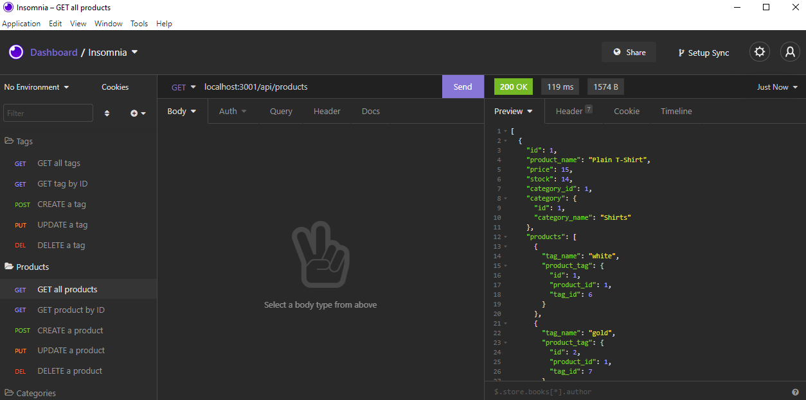

# ecommerce-backend

## Description

This app allows users to search for categories, products, and tags. Users can also add, update, or delete a category, tag, or a product.

## Installation

In order to use this application, the user must first clone this repo. Then, they must run "npm install" from the command line.

## Usage

In order to test this application, a user must open their terminal, start the sever by entering "node server", "node server.js", or "npm start". Then, use Insomnia to add, update or delete a category, tag, or a product using the routes in in the api folder of this repo.

[Watch this video for a walkthrough of the application](https://youtu.be/P00GVzccBVA)

## Contributing

Made with ❤️ by [Chase McQuown]
